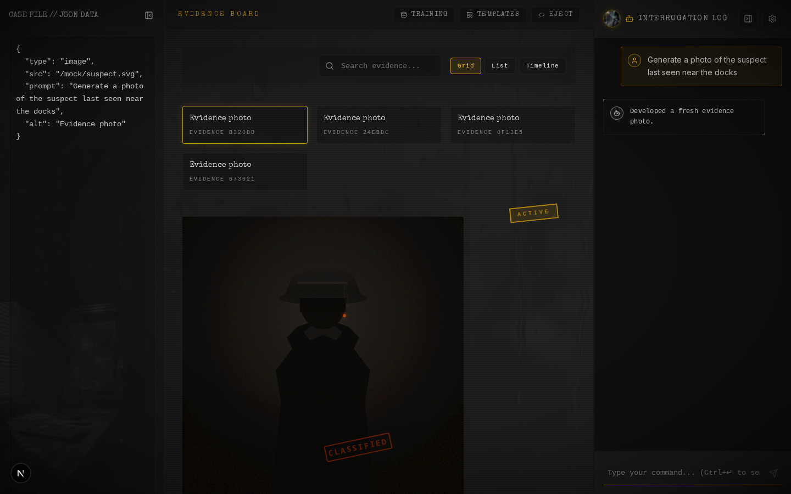
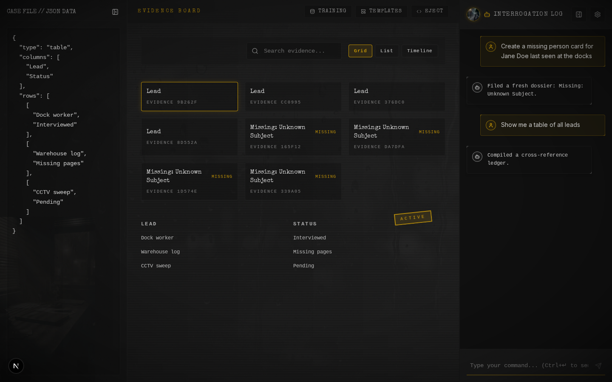

# synthNoirUI

> _"The rain never stops in this town. Neither does the code."_

An [A2UI Protocol](https://a2ui.org/) showcase built as a noir-themed AI interface. Inspired by [Lovable](https://lovable.dev).

[]()
[]()





## What This Is

synthNoirUI is a full-stack reference implementation of the **A2UI (Agent to UI) Protocol**. The protocol defines a typed, declarative JSON schema for AI agents to generate rich UI components -- cards, tables, forms, timelines, images -- streamed and rendered in real time. The noir detective persona and evidence board aren't just theming; they're the proving ground for the protocol.

The project implements two protocol versions:

- **A2UI v0.9** -- 18 component types streamed via SSE as JSONL messages (`createSurface`, `updateComponents`)
- **Legacy protocol** -- 23 component types delivered through Vercel AI SDK tool calls, validated with Zod schemas

Both protocols produce the same visual output. The v0.9 path is the active development target.

**A2UI Protocol resources:**

- [a2ui.org](https://a2ui.org/) -- Official site, docs, and quickstart
- [google/A2UI](https://github.com/google/A2UI) -- GitHub repository (Apache 2.0)
- [v0.9 Protocol Spec](https://github.com/google/A2UI/blob/main/specification/0.9/docs/a2ui_protocol.md) -- Draft specification this project targets
- [v0.8 Stable Spec](https://a2ui.org/specification/v0.8-a2ui/) -- Current stable release

## Core Capabilities

- **Chat + UI generation** -- Conversational AI that produces structured UI components alongside narrative text
- **Evidence board** -- Persistent workspace displaying generated components with search, filter, and history
- **Code export** -- Any generated component can be ejected to standalone React + Tailwind code
- **Live sandbox** -- Exported code runs in an embedded Sandpack environment for immediate preview
- **Multi-provider AI** -- OpenAI, Anthropic, Google Gemini, or any OpenAI-compatible endpoint
- **Image generation** -- AI-generated noir-styled evidence photos
- **Ambient effects** -- Rain, fog, vinyl crackle, typewriter sounds, and TTS voice output
- **Customization** -- Aesthetic profiles for colors, audio, voice, and visual effects
- **Template library** -- 8 pre-built component templates
- **Undo/redo** -- Full state history with keyboard shortcuts

## Quick Start

```bash
pnpm install

# At least one AI provider key is required
echo "OPENAI_API_KEY=sk-..." > .env.local
# Alternatives: ANTHROPIC_API_KEY, GOOGLE_GENERATIVE_AI_API_KEY

pnpm dev
```

Open [http://localhost:3000](http://localhost:3000).

## Commands

```bash
pnpm dev          # Dev server on port 3000
pnpm build        # Production build
pnpm check        # CI gate: prettier + eslint + vitest + build
pnpm test         # Unit/integration tests (Vitest)
pnpm e2e          # E2E tests (Playwright)
```

## Environment Variables

```bash
# AI provider -- first available key is used
OPENAI_BASE_URL=                      # OpenAI-compatible proxy URL
OPENAI_API_KEY=                       # OpenAI
ANTHROPIC_API_KEY=                    # Anthropic
GOOGLE_GENERATIVE_AI_API_KEY=         # Google Gemini

# Optional overrides
AI_MODEL=                             # Default chat model
AI_IMAGE_MODEL=                       # Default image model
```

## Project Structure

```
src/
├── app/
│   ├── api/a2ui/stream/  # A2UI v0.9 SSE streaming endpoint
│   ├── api/chat/         # Legacy chat endpoint (Vercel AI SDK tool calls)
│   ├── api/tts/          # Text-to-speech proxy
│   └── api/images/[id]/  # Serve generated images
├── components/
│   ├── a2ui/             # A2UI v0.9 component catalog + theme system
│   ├── board/            # Evidence board history panel
│   ├── chat/             # Chat sidebar + settings
│   ├── eject/            # Code export + Sandpack sandbox
│   ├── layout/           # Main workspace orchestration
│   ├── noir/             # Ambient effects (rain, fog, crackle, typewriter)
│   ├── renderer/         # Legacy A2UI component renderer
│   └── settings/         # Model selector, customization panels
└── lib/
    ├── a2ui/             # A2UI v0.9 protocol types + message schemas
    ├── ai/               # Provider factory, tool definitions, model registry
    ├── api/              # Rate limiting + CSRF security
    ├── protocol/         # Legacy Zod schemas + shared token maps
    ├── store/            # Zustand store (chat state, evidence, settings)
    ├── customization/    # Profile storage, CSS injection, aesthetic types
    └── eject/            # A2UI-to-React code generation
```

## Tech Stack

| Layer      | Technology              |
| ---------- | ----------------------- |
| Framework  | Next.js 16 (App Router) |
| AI         | Vercel AI SDK 6         |
| State      | Zustand 5               |
| Validation | Zod 4                   |
| Styling    | Tailwind CSS 4          |
| Animation  | Framer Motion           |
| Testing    | Vitest + Playwright     |

## Documentation

- [Product Spec](docs/PRODUCT.md) -- Vision, features, design guidelines
- [Architecture](docs/architecture.md) -- Technical design and data flows
- [Development Guide](docs/DEVELOPMENT.md) -- Setup, workflow, code style
- [A2UI v0.9 Spec](docs/reference/a2ui-v09-spec.md) -- Current protocol specification
- [A2UI Protocol](docs/reference/a2ui-protocol.md) -- Legacy component schema reference

## License

MIT
