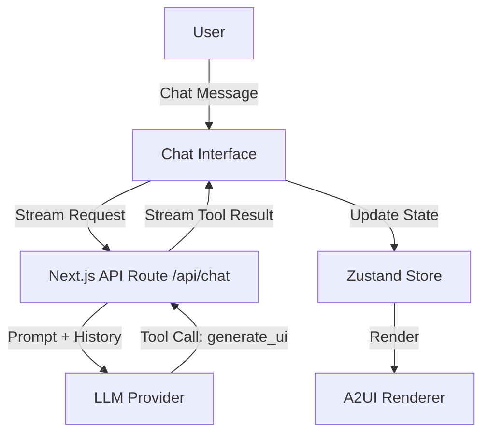

# synthNoirUI: AI Chat Integration Architecture (v1.0)

## 1. Introduction
This document establishes the architectural blueprint for the AI Chat Integration in synthNoirUI. It bridges the gap between the "Detective Desk" UI and the "Detective Brain" AI logic.

### Relationship to Existing Code
This design builds on the established Next.js + Tailwind v4 + Zod foundation. It introduces server-side AI orchestration and client-side state synchronization.

## 2. High Level Architecture
### Technical Summary
The system uses a streaming serverless architecture. The frontend (Next.js) requests a stream from the backend (`/api/chat`) via `useChat` + `DefaultChatTransport`, including the current evidence in the request body. The API orchestrates an LLM call with tool-calling enabled. Results are streamed back as UI messages and used to update a client-side Zustand store.

### High Level Diagram

## 3. Tech Stack
| Category | Technology | Version | Purpose |
| :--- | :--- | :--- | :--- |
| Framework | Next.js | 16.x | Application Core |
| AI SDK | Vercel AI SDK | 6.x | Streaming & Tools |
| State | Zustand | 5.x | Evidence State |
| Schema | Zod | 4.x | Protocol Validation |
| Auth | Multi-Tier | N/A | CLI/Env Key Discovery |

## 4. Components
### DetectiveBrain (API)
- **Role:** Handles the LLM interaction.
- **Pattern:** Uses Vercel AI SDK `streamText` with tools.
- **Persona:** Injects the "Hard-boiled Detective" system prompt.

### ProviderFactory (Server-only)
- **Role:** Resolves API keys.
- **Hierarchy:** process.env -> local config (`~/.local/share/opencode/auth.json`) -> request headers.

### ChatSidebar (Client)
- **Role:** UI for conversation.
- **Pattern:** `useChat` from `@ai-sdk/react`, backed by `DefaultChatTransport`.

## 5. Core Workflows
### AI UI Generation
1. User sends a chat message.
2. `/api/chat` normalizes messages and calls `convertToModelMessages`.
3. AI calls `generate_ui` with `{ component }`, where `component` is validated as `A2UIInput`.
4. Server resolves image prompts, validates output as `A2UIComponent`, and returns it.
5. Server streams UI messages via `toUIMessageStreamResponse`.
6. Client inspects `message.parts` (with legacy `toolInvocations` fallback) and updates Zustand.
7. Renderer displays the new component.

## 6. Coding Standards
- **Server-Only:** Auth logic must never be imported in client components.
- **Protocol First:** All UI updates must originate from a valid A2UI JSON artifact.
- **Test-Driven:** Test the `/api/chat` logic with mock LLM responses.
